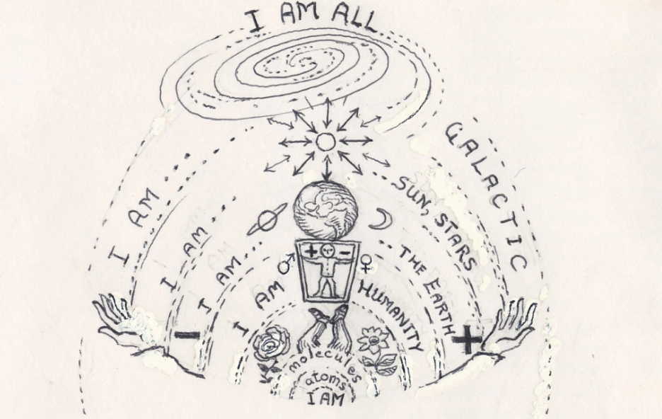

# Who are we really

## This chapter introduces the concept of exploring one's true identity beyond the public self, blending ancient wisdom with modern scientific understanding. It invites you to conduct experiments to test the idea that your innermost nature is boundless and timeless.

[Watch this on YT](https://youtu.be/oHcjkdo3cO8?si=2aRtiyim34sgCzoZ) (6:33)

Hi, my name is Richard Lang. I’m inviting you to take a fresh look at yourself—a fresh look at your identity. But why should you do this?

Imagine if someone told you that you were, in fact, a king or queen, that you owned dozens of castles, yachts, and untold riches. Wouldn’t you want to see if it were true? And if it were true, wouldn’t you want to claim your inheritance?

There’s an ancient body of wisdom that suggests the person we usually think of as ourselves—the one we see in the mirror—is only part of who we really are. That’s our public identity, the external self. But we also have a private identity—an inner self—which, according to this wisdom, is far richer and more powerful than any king or queen. This inner self is boundless and timeless, the source and container of everything.

This wisdom teaches that the purpose of life is awakening to this inner self. By looking steadily within at our divine nature, we claim our inheritance: eternal peace and unfading joy. By remaining open to this infinitely wise, loving, and creative source within us, we find ourselves blessed in countless ways.

Here, I’m not going to ask you to simply believe this ancient wisdom. Instead, I’m inviting you to carry out experiments to test it for yourself—to see if this claim about who we really are holds true.

Let me begin by rephrasing this spiritual claim about identity in modern physical terms. What we are at the center—at zero distance—is nothing like what we are from, say, four feet away, or from any distance. In fact, science supports this idea: what something is depends, in part, on the range of the observer.

For example, you’re looking at me from a few feet away, and from that range, I’m human—I’m Richard. But if you were to examine me with a microscope, you’d leave “Richard” behind and see a layer of cells. Zooming closer, you’d find molecules, then atoms, particles, and eventually, nearly nothing at all. In other words, we’re made up of layers, like an onion.

Now, instead of zooming in on me, imagine zooming out. Moving away, “Richard” would be replaced by London, then England, then the planet, the star system, the galaxy, and so on. Here’s a diagram of these outer layers:

We need all of these layers to exist. To breathe, we need not only our lungs, cells, and molecules but also the atmosphere, the Sun, and the rest of life. Although we primarily identify with the human layer—the one visible from a few feet away—we rely on every layer. It’s one undivided system.

So, who or what is at the center of all these layers? Who am I at the core? Who are you at the center of your being?

Others can tell us what we are from a distance, but they cannot tell us what we are at our center. They remain outside us, distant from us. Each of us is at our own center, perfectly placed to discover who we are.

As I look at my center now, I find no face or appearance. Instead, I see boundless transparency—a clear space filled with the whole world. I can’t show you this space. When you look at me, you see my face. But what I can do is invite you to look within yourself, to see if you are in the same boundless condition that I find in myself.

So, let’s explore this amazing claim—about you, me, and everyone else. If it’s true, and if awareness of this inner reality becomes the norm in society, I believe all life on this planet will benefit.

The first experiment I’m going to guide you through is called the [Pointing Experiment](pointing-experiment.md).

## Highlights
- Our identity has layers, from visible human form to microscopic particles and beyond
- We are part of an interconnected system, needing all layers to exist
- At our center lies a boundless, aware space that contains the whole world

## Reflection?
- How might your perspective on life change if you truly saw yourself as boundless awareness?
